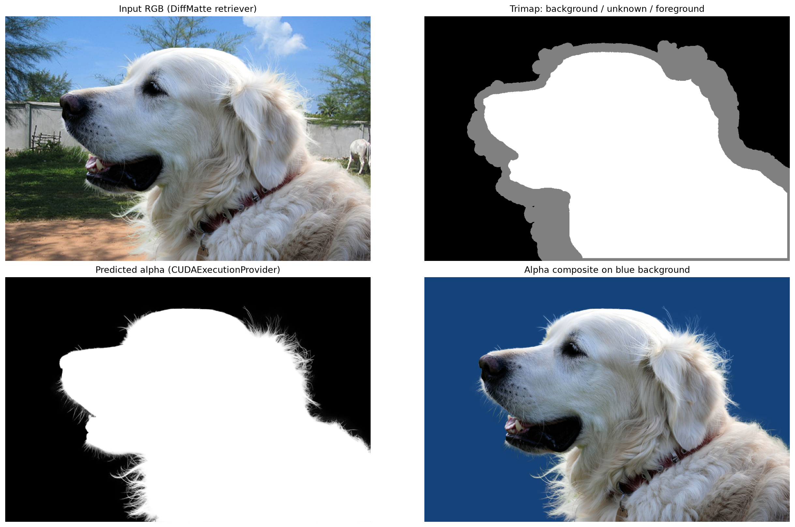

# DiffMatte ONNX Runtime

事前生成済み DiffMatte ONNX モデルを、PyTorch・Detectron2 なしで実行するための uv プロジェクトです。モデルのエクスポートと PyTorch 比較は [`DiffMatte` の `gtx1070` ブランチ](https://github.com/yuki-inaho/DiffMatte/tree/gtx1070)側で行います。

## モデル取得

| 用途 | モデル | Release |
|---|---|---|
| CPU ONNX Runtime | `diffmatte_vits_1024_ddim10_643x960.onnx`（IR v10） | [`gtx1070-onnx-v0.1.0`](https://github.com/yuki-inaho/diffmatte_onnx/releases/tag/gtx1070-onnx-v0.1.0) |
| GTX 1070 GPU | `diffmatte_vits_1024_ddim10_643x960_gtx1070.onnx`（IR v9） | [`gtx1070-onnx-v0.1.1`](https://github.com/yuki-inaho/diffmatte_onnx/releases/tag/gtx1070-onnx-v0.1.1) |

両モデルは固定形状 `N=1, H=643, W=960` の公式 retriever サンプル向けです。GTX 1070 互換版は、演算グラフと opset 18 を変えず ONNX IR version だけを 10 から 9 に下げたものです。ダウンロード後は対応する `models/*.onnx.json` の SHA-256 と照合してください。

## セットアップ（GPU）

```bash
uv sync --extra runtime-gpu --extra notebook --extra dev
```

GTX 1070（Pascal / compute capability 6.1）で確認した組合せは、`onnxruntime-gpu==1.16.3`、CUDA 11.8、cuDNN 8 です。`--provider cuda` は CUDAExecutionProvider が実際に初期化できなければエラーにするため、CPU へ黙ってフォールバックしません。古い ORT の FusedConv 最適化はこの opset 18 モデルと互換ではないため、CUDA 指定時だけ runtime 側で無効化します。

公式 retriever の RGB / trimap を GPU 推論して可視化する notebook は [`notebooks/onnxruntime_gpu_retriever_visualization.ipynb`](notebooks/onnxruntime_gpu_retriever_visualization.ipynb) です。モデルがなければ Release から取得し、SHA-256 を検証してから実行します。

```bash
uv run --extra runtime-gpu --extra notebook \
  jupyter lab notebooks/onnxruntime_gpu_retriever_visualization.ipynb
```

2026-08-11 に GTX 1070 で実行した出力です。左下が CUDAExecutionProvider の推定 alpha、右下が青背景への合成です。



実行記録: `CUDAExecutionProvider` が有効、seed `0`、入力 `[1, 3, 643, 960]`、この実行では session 作成を含めて 32.89 秒でした（性能ベンチマークではありません）。CPU 版との PNG 比較は最大画素差 `1`、平均差 `3.24e-06` でした。

再現条件・モデル hash・provider・画素比較の詳細は [`reports/retriever_gpu_gtx1070.json`](reports/retriever_gpu_gtx1070.json) に記録しています。

## セットアップ（CPU）

```bash
uv sync --extra runtime-cpu --extra dev
```

## 推論

```bash
uv run diffmatte-infer-onnx \
  --model models/diffmatte_vits_1024_ddim10_643x960_gtx1070.onnx \
  --image demo/retriever_rgb.png \
  --trimap demo/retriever_trimap.png \
  --output artifacts/retriever_alpha.png \
  --provider cuda \
  --seed 0 \
  --report artifacts/inference.json
```

CPU 実行時は、上の `--model` を IR v10 の `models/diffmatte_vits_1024_ddim10_643x960.onnx` に替え、`--provider cpu` を指定してください。

`--noise-npy` を指定すると、エクスポータ側の PyTorch 比較で使った初期ノイズをそのまま再利用できます。

`--enforce-known-trimap` は既知 foreground/background を後処理で 1/0 に固定します。指定しない場合は upstream の挙動を保ち、ONNX/PyTorch の数値比較が可能です。
